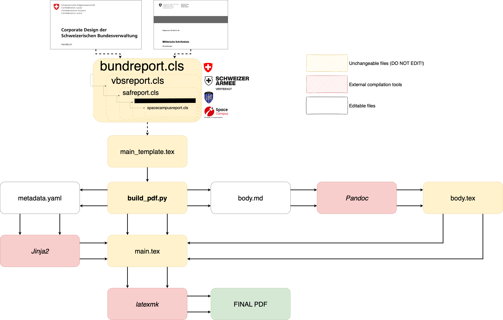

# LaTex-Bund
PDF generator and CH Bund LaTex template for Markdown text.

## Introduction
Tasked with creating a unified structure of documentation for the Swiss Confederation, the purpose of this repository is to transform Markdown text files into pre-made LaTex templates based on the guidelines from the official Corporate Design of the Confederation (CD Bund) and Reglementation 52.002 (Militärische Schriftstücke), in order to output a PDF file that is in accordance with the aforementioned guidelines.

## Pre-requisites
* **Python 3.x**
  
  The main scripting language used in this project. You can download it from [python.org](https://python.org).

* **PyYAML**

  YAML parser and emitter for Python. Install via pip:

  ``pip install pyyaml``
  
* **Pandoc**

  A universal document converter used to transform markdown and other formats.
  [Installation instructions](https://pandoc.org/installing.html).
  
* **Jinja2**

  A templating engine for Python used to render dynamic content. Install via pip:

  ``pip install Jinja2``

* **LaTex compiler**

  Required for compiling ``.tex`` files into PDF.

  * Linux: Install TeX Live via your package manager (e.g.: ``sudo apt install texlive-full``)
 
  * Windows / Mac: Use [MiKTeX](https://miktex.org/download).

## Project Directory Explanation
~~~
project-root/
├── README.md              # Ignore.
├── body.md                # The editable Markdown file to include the document body.
├── build_pdf.py           # The code to run that will generate the PDF based on the markdown body and selected template.
├── metadata.yaml          # The editable .YAML file to input report metadata (title, author, date, etc.)
├── overview.png           # Ignore.
├── classes/               # Folder where all LaTex document classes are stored.
│ └── bundreport.cls       # Example of a LaTex class.
├── layout/                # Folder where document LaTex template + additional layout settings are stored.
│ ├── main_template.tex    # Main LaTex template that inherits parameters from the class and additional layout settings.
│ ├── titlepage.tex        # Example of additional layout settings.
├── logos/                 # Folder where all template logos are stored.
│ └── shield_bund.png      # Example of a template logo.
~~~

## How to use
The only things required by the user are to:
1. Edit the content of ``body.md`` to include whatever is required in the report.
2. Edit the parameters in ``metadata.yaml`` to fit the report.
3. Run ``build_pdf.py`` to generate the PDF.

### Detailed explanation

``build_pdf.py`` is the orchestrator of the project. When this file is run the following happens:
1. Using Pandoc, the script converts a Markdown file (``body.md``) into a LaTeX fragment (``body.tex``). This separates the content layer Markdown from the layout logic.
2. A copy of the template (``main_template.tex``) is created (``main.tex``). This template comes pre-loaded with a document class (``\documentclass{classes/...}``) that specifies which ``.cls`` template to use from the ones located in the classes subfolder.
3. The script reads structured metadata from ``metadata.yaml`` and injects it in place of the custom Jinja2 delimiters in ``main.tex`` that act as placeholders for the metadata.
4. The template already has a predefined ``body.tex`` specified in it (``\input{body.tex}``), so when ``main.tex`` is generated, it automatically loads the LaTex body file generated by Pandoc in step 1.
5. The script runs ``latexmk`` with ``pdflatex`` in nonstop mode to compile ``main.tex`` into a PDF. This ensures multi-pass compilation if needed (note: When working with Overleaf, these multi-passes are performed inherently when clicking the *compile* button, however it is not done inherently when locally compiling with ``latexmk``, hence why the nonstop mode is enabled).
6. Finally, the script removes LaTeX auxiliary files (e.g.: ``.aux``, ``.fls``, ``.fdb_latexmk``) and other temporary fragments (e.g.: ``body.tex``) to keep the workspace clean. The only file that it does not delete is the ``.log`` file, such that in the event of a compiling error, the logs can be analyzed. It is possible to delete it automatically however by simply adding ``.log`` to the ``cleanup_aux_files`` command.

## Credits / Acknowledgments
This project is developed and maintained by **Marcos Cabanas**.

Special thanks to the developers and maintainers of the following tools that made this work possible:

- [Pandoc](https://pandoc.org/) – for document format conversion
- [Jinja2](https://jinja.palletsprojects.com/) – for LaTeX-compatible templating
- [LaTeX](https://www.latex-project.org/) – for professional-quality typesetting
- [latexmk](https://mg.readthedocs.io/latexmk.html) – for automated LaTeX compilation
- [Python](https://www.python.org/) – the core language used to script the pipeline

Gratitude also goes to the open-source community for maintaining the tools and libraries used in this repository.
