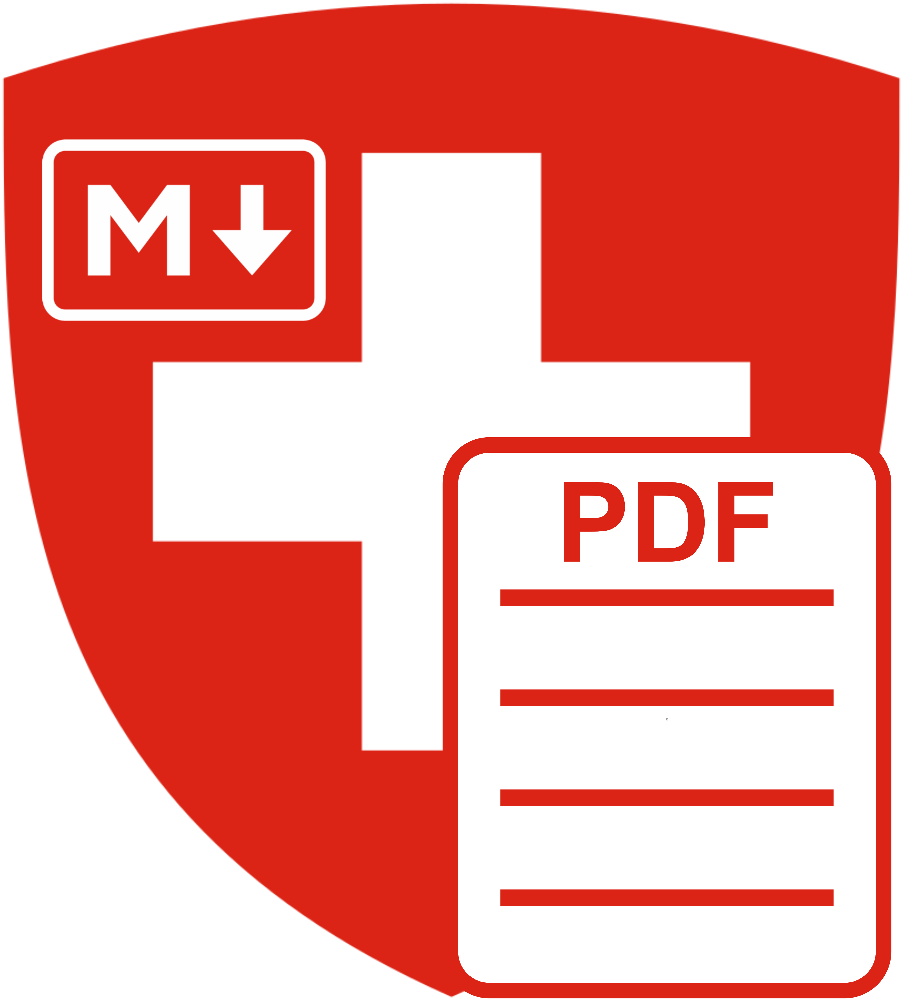
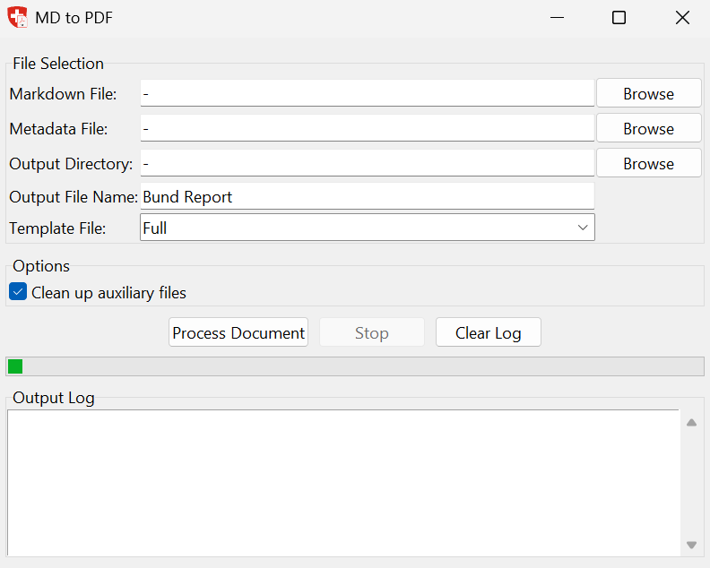
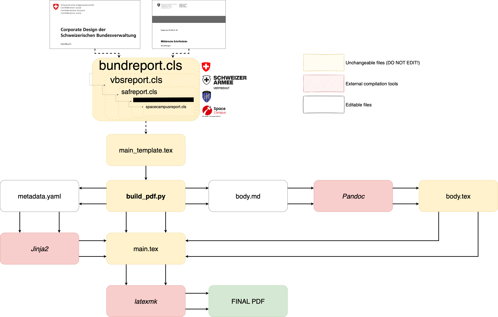

# LaTex-Bund
PDF generator and CH Bund LaTex template for Markdown text.
<p align="center">
  
</p>

<p align="center">
  <strong>Markdown to PDF</strong>
</p>

<p align="center">
  
  
</p>

## Introduction
Tasked with creating a unified structure of documentation for the Swiss Confederation, the purpose of this repository is to transform Markdown text files into PDFs based on the guidelines from the official Corporate Design of the Confederation (CD Bund) and Reglementation 52.002 (Militärische Schriftstücke), in order to output a PDF file that is in accordance with the aforementioned guidelines.

## Pre-requisites

* **Pandoc**

  A universal document converter used to transform markdown and other formats.
  [Installation instructions](https://pandoc.org/installing.html).
  

* **LaTex compiler**

  Required for compiling ``.tex`` files into PDF. Two compilers have been tested:
  - [MiKTeX](https://miktex.org/download) 
    -  Full-featured LaTeX distribution
    -  Large installation size
    -  **For windows:** Needs Perl [Strawberry Perl] to be intalled 
   - [TinyTex](https://yihui.org/tinytex/) 
     - Minimal and lightweight
     - Packages need to installed with
```bash
tlmgr install changepage, textpos, lastpage, fancyhdr, anyfontsize, titlesec, enumitem
```
 
Make sure all of these tools are accessible from your system's PATH.

## Project Directory Explanation
~~~
Project Structure
├── .gitignore       # for git
├── App/             # contains .exe binary files
├── Example/         # exemple .md and .yaml files
├── README.md           
├── requirements.txt 
└── src/
    ├── classes      # contains LaTeX .cls files
    ├── layout       # contains LaTeX .tex templates
    ├── logos        # images for PDF and application
    ├── utils        # usefull functions
    ├── GUI.py       # main python script
    └── GUI.spec     # pyinstaller config file
~~~

## How to use
1. Ensure pre-requisites are installed
2. Open Application

3. Select Markdown and Metadata file
4. Select directory where you want to save the PDF
5. Click "Process Document"

### Detailed explanation

``GUI.py`` is the orchestrator of the project. When this file is run the following happens:
1. Using Pandoc, the script converts a Markdown file (``body.md``) into a LaTeX fragment (``body.tex``). This separates the content layer Markdown from the layout logic.
2. A copy of the template (``main_template.tex``) is created (``main.tex``). This template comes pre-loaded with a document class (``\documentclass{classes/...}``) that specifies which ``.cls`` template to use from the ones located in the classes subfolder.
3. The script reads structured metadata from ``metadata.yaml`` and injects it in place of the custom Jinja2 delimiters in ``main.tex`` that act as placeholders for the metadata.
4. The template already has a predefined ``body.tex`` specified in it (``\input{body.tex}``), so when ``main.tex`` is generated, it automatically loads the LaTex body file generated by Pandoc in step 1.
5. The script runs ``latexmk`` with ``pdflatex`` in nonstop mode to compile ``main.tex`` into a PDF. This ensures multi-pass compilation if needed (note: When working with Overleaf, these multi-passes are performed inherently when clicking the *compile* button, however it is not done inherently when locally compiling with ``latexmk``, hence why the nonstop mode is enabled).
6. Finally, the script removes LaTeX auxiliary files (e.g.: ``.aux``, ``.fls``, ``.fdb_latexmk``) and other temporary fragments (e.g.: ``body.tex``) to keep the workspace clean.
## Building the app from source code
1. Make sure you are in the ``src`` directory
2. Run following command for windows
```bash
pyinstaller GUI.spec --distpath ..\App\Windows\exe --workpath ..\App\Windows\build
```
and for macOS
```bash
pyinstaller GUI.spec --distpath ..\App\macOS\exe --workpath ..\App\macOS\build
```
3. The executable is now it the \App\OS\exe file

## Credits / Acknowledgments
This project is developed and maintained by **Marcos Cabanas** with help from **Kelan Solomon**.

Special thanks to the developers and maintainers of the following tools that made this work possible:

- [Pandoc](https://pandoc.org/) – for document format conversion
- [Jinja2](https://jinja.palletsprojects.com/) – for LaTeX-compatible templating
- [LaTeX](https://www.latex-project.org/) – for professional-quality typesetting
- [latexmk](https://mg.readthedocs.io/latexmk.html) – for automated LaTeX compilation
- [Python](https://www.python.org/) – the core language used to script the pipeline

Gratitude also goes to the open-source community for maintaining the tools and libraries used in this repository.
